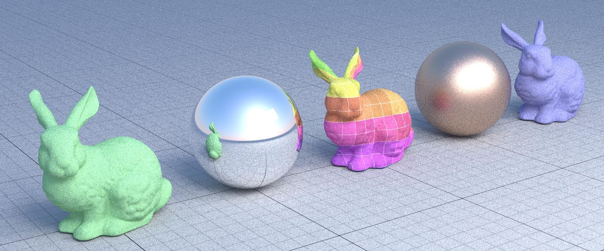
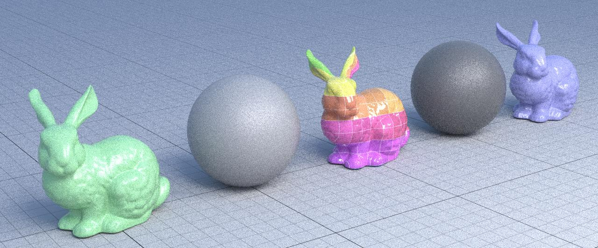
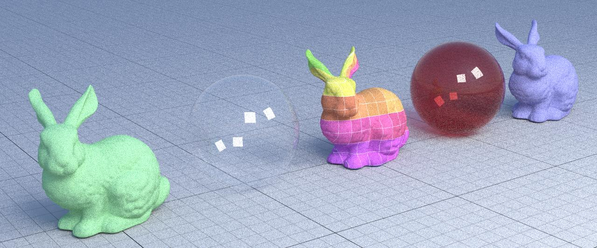
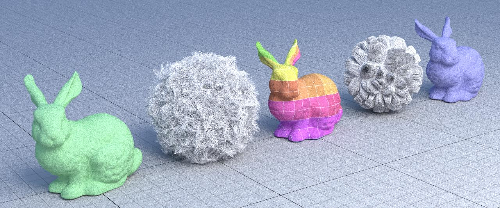
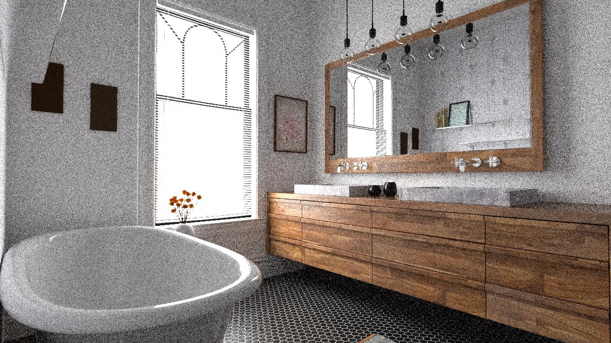
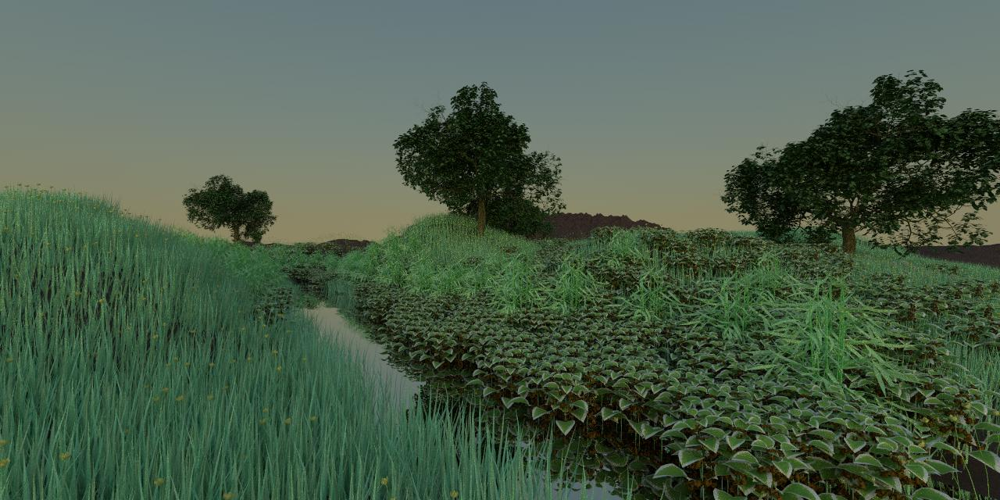

# Yocto/Raytrace: Tiny Raytracer

In this homework we aim to learn the basics of image synthesis by
implementing a simple, naive, path tracer. In particular:
- setup camera and image synthesis loops,
- usa ray-intersection queries,
- write simple shaders,
- write a naive path tracer with simple sampling.

(The original readme of the homework can be found as `readme.html`)
## Framework

The code uses the library [**Yocto/GL**](https://github.com/xelatihy/yocto-gl),
that is included in this project in the directory `yocto`.

In order to compile the code, you have to install
[Xcode](https://apps.apple.com/it/app/xcode/id497799835?mt=12)
on OsX, [Visual Studio 2019](https://visualstudio.microsoft.com/it/vs/) on Windows,
or a modern version of gcc or clang on Linux,
together with the tools [cmake](www.cmake.org) and [ninja](https://ninja-build.org).
The script `scripts/build.sh` will perform a simple build on OsX.

Main functionalities are implemented in `yocto_raytrace.cpp`.

This repository also contains tests that are executed from the command line
as shown in `run.sh`. The rendered images are saved in the `out/` directory.
The results should match the ones in the directory `check/`. High resolution
images are computed by `run-highres.sh`.

## Functionality

In this homework/project the following features are implemented:

- **Main Rendering Loop** in function `raytrace_samples()`  
- **Color Shader** in function `shade_color()`
- **Normal Shader** in function `shade_normal()`
- **Texcoord Shader** in function `shade_texcoord()`
- **Eyelight Shader** in function `shade_eyelight()`
- **Raytrace Shader** in function `shade_raytrace()`
- **Thick lines and points** (hard): the rendering of points and lines was
  too approximate; in this project we will compute these intersections accurately
  - render points as spheres and lines as capped cones using the following algorithms found [here](https://iquilezles.org/www/articles/intersectors/intersectors.htm) with names Sphere and Rounded Cone.
  - Extra details (implementation and test images) on this part are discussed in `report.md`

## Some renders
### Metals

### Plastic

### Glass

### Hair

### Some test scenes
* Bathroom - 256 spp

* Ecosys - 256 spp
