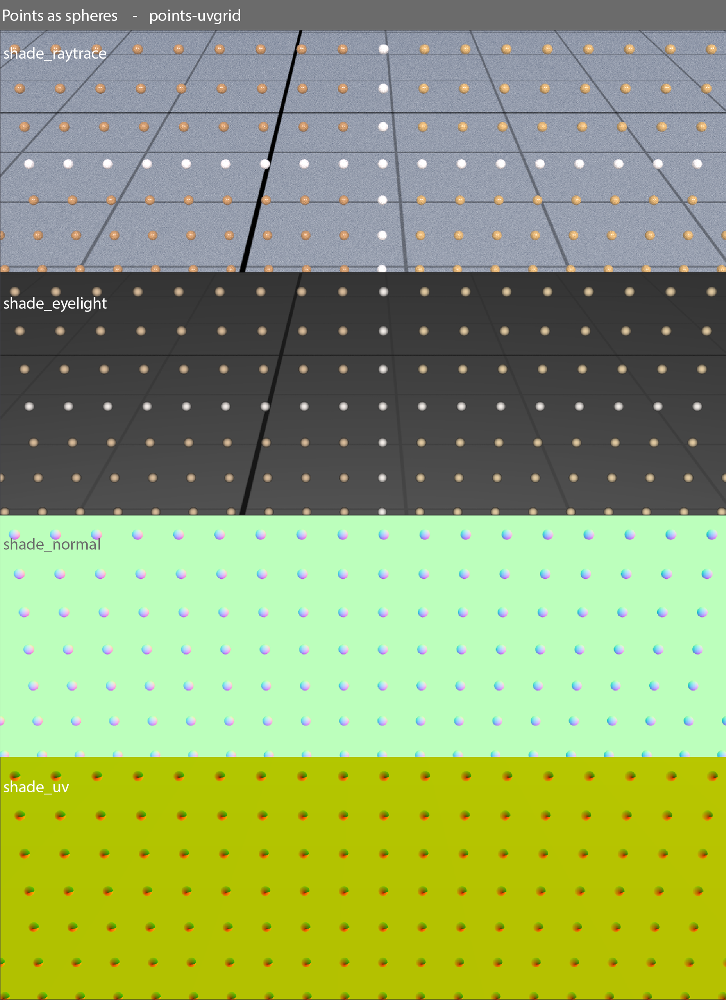
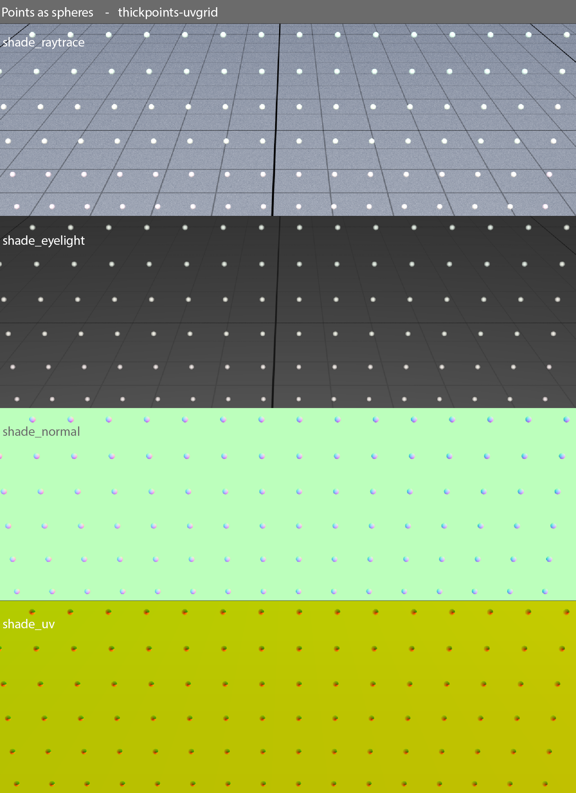
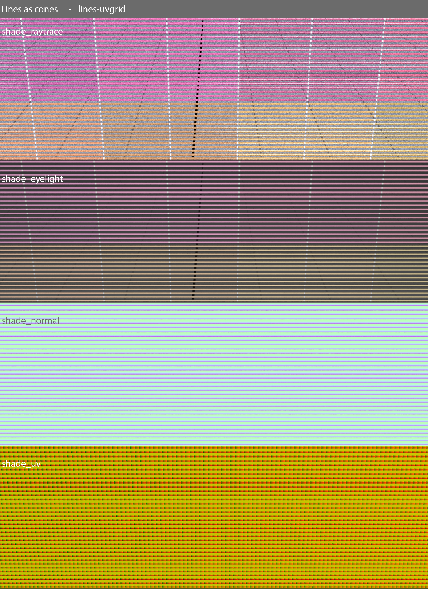
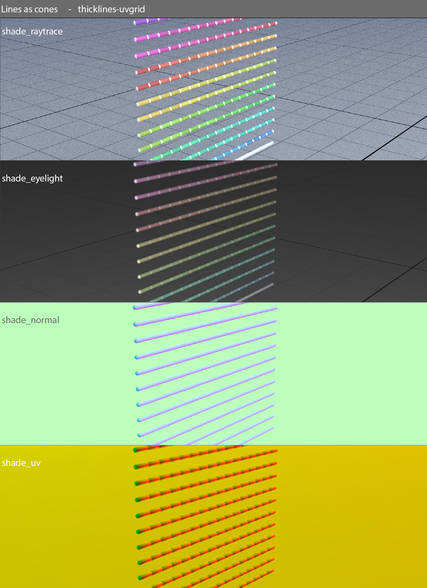
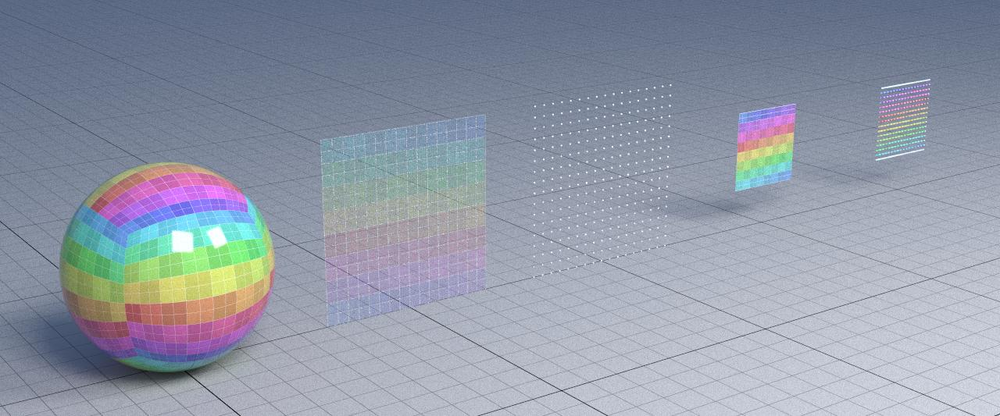
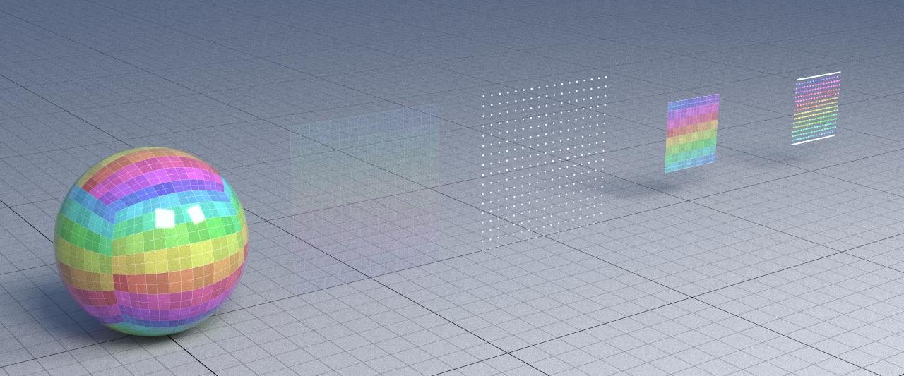

# Extra credit report
This is the report for the the first homework for Fundamentals of computer graphics course. In particular here I'm explaining my approach for implementing the "thick lines and points" extra credit.

## Thick lines and points
The rendering of points and lines was too approximate; in this extra credit the objective is to render them in a more accurate way.
The idea is to:
  - render points as spheres 
  - render lines as capped cones

My solution is based on the intersection algorithms provided [here](https://iquilezles.org/www/articles/intersectors/intersectors.htm) as *"Sphere intersection"* and *"Rounded cone intersection"*.

## How the code is setup
For both intersection algorithms I decided to calculate position, normal and uvs directly in the intersection code (no particular reason, it's just easier) and I put them in a modified version of `bvh_intersection` struct:


```cpp
struct bvh_intersection
{
  ...
  vec2f uv;       // Hit point uvs
  vec3f normal;   // Hit point normal
  vec3f position; // Hit point
  float distance; // Ray distance
};
```

Obviously for allowing these extra informations to be set during the intersection check I pass them as referenced arguments (e.g. `vec3f& normal`), and so I needed also to change all `intersect_bvh` functions' parameters.

## Extra parameters for `yocto_raytrace` app
For deciding which implementation to use for rendering lines (choice between line intersection and cone intersection) and points (choice between point intersection and sphere intersection) I decided to add two extra arguments to `raytrace_params` struct:

```cpp
struct raytrace_params
{
  ...
  bool point_as_sphere  = false;
  bool line_as_cone     = false;
};
```

These two extra parameters so are used in:
  - `shade_raytrace()`/`normal()`/`eyelight()`: for deciding whether to retrieve position and normals from `eval_position` and `eval_normal` or from `bvh_intersection` struct
  - `intersect_bvh()`: for deciding whether to use `intersect_point()`/`line()` or `intersect_sphere()`/`_rounded_cone()` (i.e. new intersection methods)

**Note:** These two extra parameters can also be set on the *interactive app*

## Additional debugging shader for uv
I decided to add a new shader for debugging purposes which "draw" the uv calculated on the intersection. It's called `shade_uv` and can be found in `yocto_raytrace.cpp`

## Sphere intersection
Code for sphere intersection is the same provided [here](https://iquilezles.org/www/articles/intersectors/intersectors.htm), except for the uvs which are calculated as in the old `intersect_sphere()` which was in yocto.

This gives us the following results:
* Thin points:


* Thick points:
  


## Cone intersection
For cone intersection I decided to create two functions:
1. `_intersect_rounded_cone()`: this is kinda a "private" function, or something that should not be used directly. It checks for the intersection but only set the *distance* and the *normal* and check if the intersection is valid (i.e. `ray.tmin <= t <= ray.tmax`).
2. `intersect_rounded_cone()`: this call `_intersect_rounded_cone()`, and then calculate also the uv, which are calculated in the same way for all the intersection points (i.e. sides spheres and middle "cylinder").

*uv* are calculated as:
* **u:** as in the line intersection
* **v:** as in the sphere intersection

This gives us the following results:
* Thin lines:

* Thick lines:
  


## Overall result

* Points as spheres and lines as cones:


* Points as points and lines as lines:


Other comparing images in `out/extra/` folder.

## How to launch a test scene

For launching an interactive test on a test scene, just run:
```bash
./bin/yraytrace --scene tests/shapes4/shapes4.json --samples 256 --bounces  8 --resolution 720 --interactive --linecone --pointsphere
```


--- Eduardo Rinaldi 1797800 ---