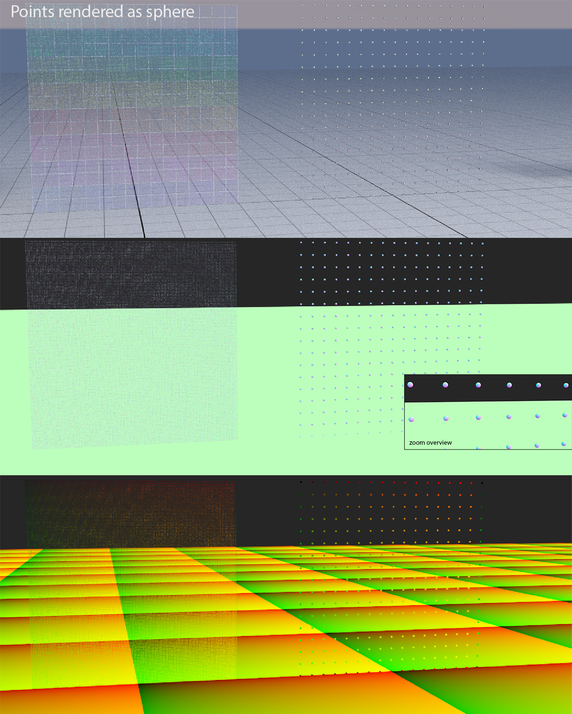
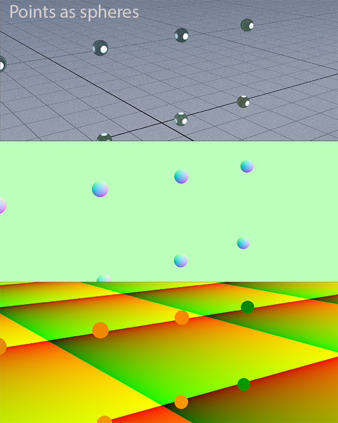

# Extra credit report

## Thick lines and points
The rendering of points and lines was too approximate; in this extra credit the objective is to render them in a more accurate way.
The idea is to:
  - render points as spheres 
  - lines as capped cones

My solution is based on the intersection algorithms provided [here](https://iquilezles.org/www/articles/intersectors/intersectors.htm) as: 
* `Rounded cone intersection`:
* `Sphere intersection`


**Note:** normals and UVs are calculated in the intersection code (no particular reason, it's just easier) and then stored in:
```cpp
struct bvh_intersection
{
  ...
  vec2f uv;
  vec3f normal;
  vec3f position;
  float distance;
};
```
## Sphere intersection
The **sphere intersection** code is very simple, we need to solve in `t` the following equation:

$$t^2 * dot(b,b) + 2t * dot(b, (A-C)) + dot((A-C), (A-C)) - r^2 = 0$$


where:
  * *A* := ray origin
  * *b* := ray direction
  * *C* := sphere center point
  * *r* := sphere radius

so we need to solve a **second degree equation** of this shape:
$$\frac{-b \pm \sqrt{b^2 - 4ac}}{2a}$$

**Note:** in the code this equation is simplified.

### Normals
Given a point `p1` on a sphere centered in a point `p2`, we can calculate the normals using the following formula:

$n = normalize(p1 - p2)$

### UVs
Given a point `p1` on a sphere with radius `r` we can calculate the UVs as follow:

- $u = atan2(p_1.z, p_1.x)$

- $v = acos(\frac{p_1.y}{r})$

### Results




## Rounded cone intersection

The **rounded cone intersection** code can be divided in two main parts:

1. Sphere intersection